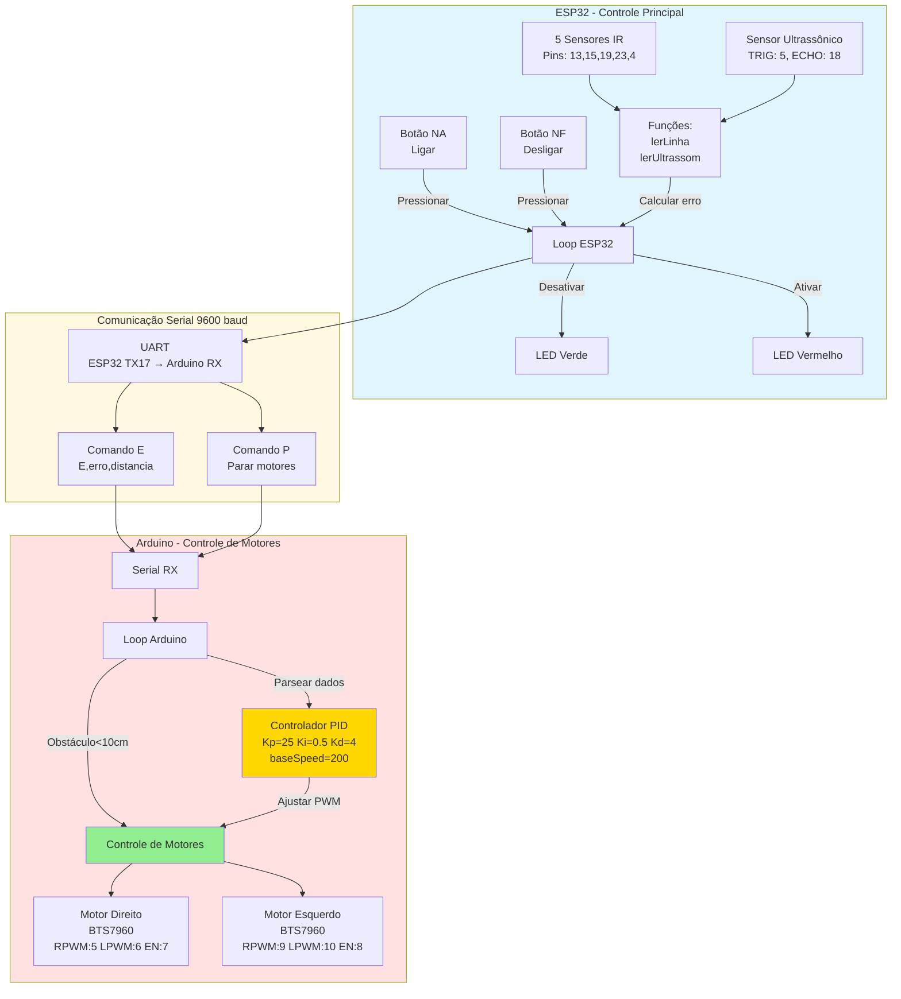

# Robô Seguidor de Linha com ESP32 e Arduino

## Visão Geral

Este projeto implementa um robô seguidor de linha que utiliza dois microcontroladores:

* **ESP32** : Gerencia sensores e lógica de controle
* **Arduino** : Controla os motores com PID

